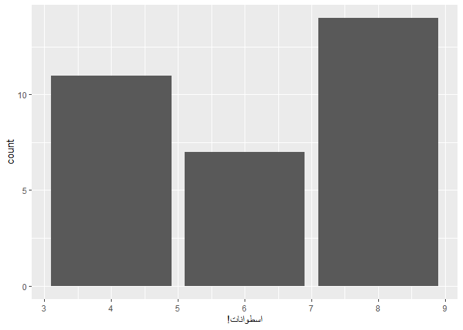
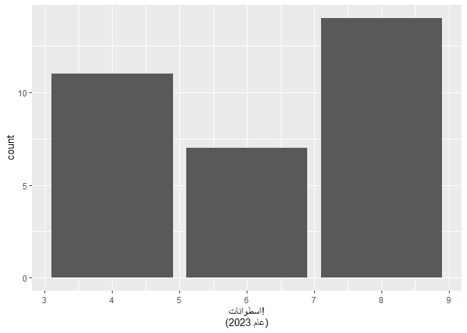
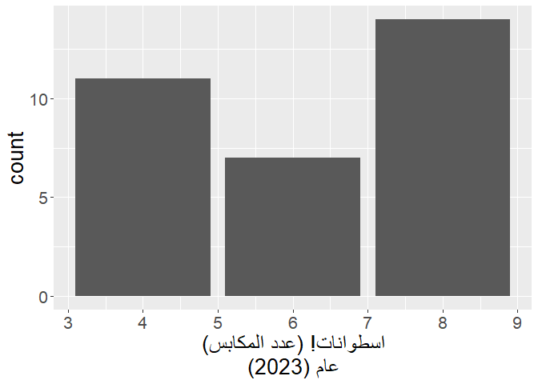
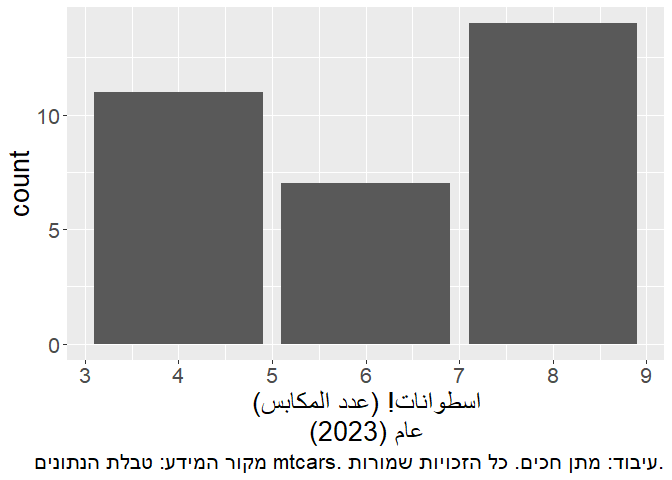

<!-- README.md is generated from README.Rmd. Please edit that file -->

# rtlr

<!-- badges: start -->
<!-- badges: end -->

The goal of rtlr is to help you print correctly right-to-left text in
the console and in plots. It was motivated by this [Stack Overflow
question](https://stackoverflow.com/questions/53915070/change-axis-text-direction-to-right-to-left)
from 2018. As of now, its main and only function is `str_rtl()`, which
wraps a string with RTL-embedding Unicode characters.

## Installation

You can install the development version of rtlr from
[GitHub](https://github.com/) with:

``` r
# install.packages("devtools")
devtools::install_github("matanhakim/rtlr")
```

## Basic Example

This is a basic example of fixing an RTL issue when writing in Hebrew.
Hebrew is written right-to-left, so punctuation marks (such as “,” or
“.”) should come at the left side, i.e. the end, of a sentance.

``` r
library(rtlr)
x <- "הנקודה צריכה להיות בסוף המשפט."
# `x` says "the dot should come at the end of the sentance." in Hebrew.

cat(x)
#> הנקודה צריכה להיות בסוף המשפט.
cat(str_rtl(x))
#> ‫הנקודה צריכה להיות בסוף המשפט.
```

Notice how the dot ends up in the left side, where it should be.

## Example in a Plot

You can also use it in plots, for example:

``` r
library(ggplot2)
#> Warning: package 'ggplot2' was built under R version 4.2.2
theme_update(text = element_text(size = 20))
ggplot(mtcars, aes(cyl)) +
  geom_bar() +
  labs(
    x = "اسطوانات!"
    # `xlab` says "cylinders!" in Arabic.
  )
```


Notice how the exclamation mark is on the right-hand side, but it should
be on the left, as Arabic is another right-to-left language. use
`str_rtl()` to solve it, like this:

``` r
ggplot(mtcars, aes(cyl)) +
  geom_bar() +
  labs(
    x = str_rtl("اسطوانات!")
  )
```



Now the exclamation mark is on the left-hand side, like it should.

Additionally, sometimes you wish to break up lines within a plot. The
easiest way to do it is by pasting `\n`, but this results yet again with
a problem in the location of non-RTL characters. Notice how the
parentheses on the top `xlab()` row are correctly placed on the left
side, but the parantheses on the bottom row are wrongly placed on the
right side.

``` r
ggplot(mtcars, aes(cyl)) +
  geom_bar() +
  labs(
    x = paste0("اسطوانات! (عدد المكابس)", "\n", "عام (2023)")
    # `xlab()` says in Arabic:
    # "cylinders! (The number of pistons)"
    # "Year (2023)"
  )
```



This can be easily solved with `str_rtl()` and `multiline = TRUE`:

``` r
ggplot(mtcars, aes(cyl)) +
  geom_bar() +
  labs(
    x = str_rtl("اسطوانات! (عدد المكابس)", "عام (2023)", multiline = TRUE)
    # `xlab()` says in Arabic:
    # "cylinders! (The number of pistons)"
    # "Year (2023)"
  )
```



A common use case for this is in the caption of a plot, where sometimes
you have to write a lot of text regarding the source of the data and the
copyrights. When you don’t notice, you can easily overflow:

``` r
ggplot(mtcars, aes(cyl)) +
  geom_bar() +
  labs(
    x = str_rtl("اسطوانات! (عدد المكابس)", "عام (2023)", multiline = TRUE),
    # `xlab()` says in Arabic:
    # "cylinders! (The number of pistons)"
    # "Year (2023)"
    caption = "מקור המידע: טבלת הנתונים mtcars. עיבוד: מתן חכים. כל הזכויות שמורות."
  )
```


